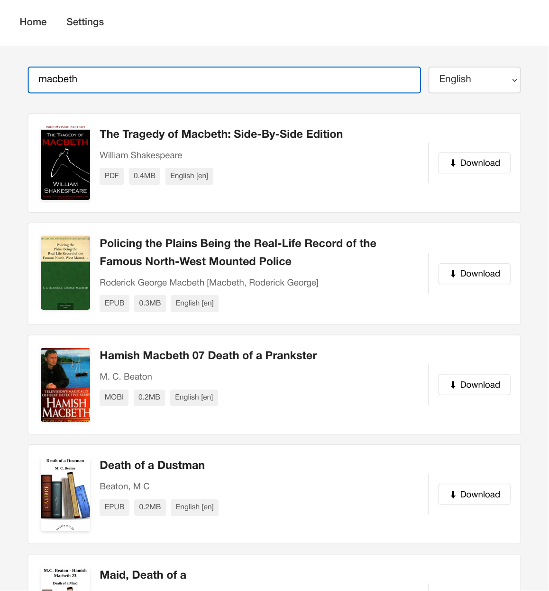
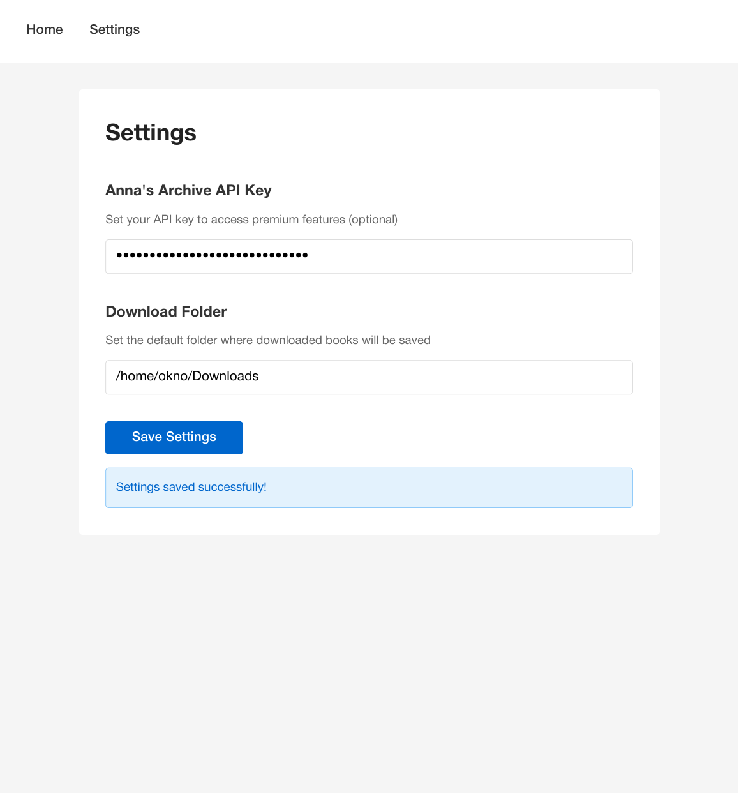

# Anna's Kazib

Anna's Kazib is a download manager app for Anna's archive. 

## Running locally

**Install Rust**

```shell
rustup toolchain install stable
rustup target add wasm32-unknown-unknown
```

**Install the Dioxus CLI**

```shell
cargo binstall dioxus-cli --version 0.7.4 --force
```

Depending on your OS you may need additional system dependencies, please refer to the [dioxus getting started guide](https://dioxuslabs.com/learn/0.7/getting_started).

**Run the app** 

```
dx serve --package kazib --web
```

## Acknoledgment

Most of the Anna's Archive API code have been taken from [RemiKalbe/annas-archive-mcp](https://github.com/remikalbe/annas-archive-mcp)

## Gallery

|  |  |
|-------------------------------------|-------------------------------------|

## LICENSE

This project is licensed under the GNU General Public License v3.0. For full details, see the [LICENSE](LICENSE) file.
